# Experiments-with-Radiation-Function-in-Genetic-Algorithms

## Introduction

Genetic Algorithms are a class of evolutionary algorithms inspired by the process of natural selection. They have been widely used to solve complex optimization problems in various fields, including logistics, and manufacturing along with research in artificial life, machine learning, artificial intelligence, biorobotics, and bioinformatics to name a few.

Over the years, genetic algorithms (GAs) has witnessed notable progress. Nonetheless, a persistent difficulty is GAs' propensity to become trapped in local optima. The goal of this research is to look at adding a "radiation" function to GAs, which is comparable to the way exposure to ionizing radiation in living organisms, changes their causing mutations in them. The "radiation" when a GA is trapped on a local optima will result in fluxes in the crossover and mutation rates. The "radiation" functionality will be triggered by a monitor function that attempts to determine whether the GA is stuck on a local optimum for "n" generations. Additionally, the GA will be able to determine whether the mutation is desirable.

One of the key components of GA's is the crossover technique, which essentially emulates the process of reproduction in living organisms. It is the process of combining genetic information (genes) of two-parent solutions to generate a new offspring, which possibly is a better solution than the parents. possibly, as that is always not the case. In this notebook, we aim to experiment with different types of crossover operations in tandem with the radiation function. We will try to analyze the performance of various crossover techniques, such as uniform crossover, blend crossover, and other similar techniques.

Through these experiments, we aim to gain a deeper understanding of how radiation function along with different crossover techniques, influences the performance of Genetic Algorithms. We will use a Fexible GA as our base and execute different crossover techiques, first without radiation function and later with it, we will also measure its ability to find optimal solutions and its convergence speed using a graphs.

### Importing libraries


```python
import numpy as np
import pandas as pd
import matplotlib.pyplot as plt
import time
from IPython.display import Markdown as md
```

### Parameter setting


```python
pop_size = 100
n_genes = 10000
n_generations = 100
mutation_rate = 0.8/n_genes
fitness_over_time = np.zeros(n_generations)
stagnation_over_time = np.zeros(n_generations)  # tracking stagnation over time
elitism = True
stagnation_limit = 4  
stagnation_count = 0  # counter for number of generations without improvement
mutation_increase = 0.9  # amount to increase mutation rate by
```

### Bitstring optimisation

Bitstring optimization is a commmon approach in Genetic Algorithms and they can be very effective for testing new types of GA's like the one we are experimenting with - a radiation function-based GA. This is because bitstring representation is often more space -efficient than any other type of representation like sequence of integers. They also allow for flexibility in crossover and mutation, when using bitstrings we can randomly choose any point for crossover. This is why it is  more flexible for experiments when compared to any other data representations which may be limited by their data structure. Mutation is also more efficient in bitstrings as it only involves flipping a bit, making it flexible to mutate with greater degree of control.


```python
# initial population 
population = np.random.choice([0, 1], size=(pop_size, n_genes))

target = np.ones((1, n_genes))  # target is a string of all 1's

# geting initial fitness
fitness = np.zeros(pop_size)
for i in range(pop_size):
    fitness[i] = n_genes - np.sum(np.abs(target - population[i, :]))

best_fitness = 0  
best_fitness_over_time = np.zeros(n_generations)  # tracks best fitness over time
```

### Radiation

The `radiation` function helps to increase the mutation rate for genes that have not changed in the best individual over time, which can help prevent stagnation in the population.

It first identifies the genes (`stagnant_genes`) that have not changed in the best individual compared to the last generation. Then it loops over each individual in the population and each gene in each individual. If a gene is stagnant and a randomly generated number is less than the mutation rate, it flips the gene (from 0 to 1 or from 1 to 0).
Finally, it returns the mutated population.
some of the key parameters related to radiation

* mutation_rate: the probability of altering one or more gene values in offspring chromosome during the mutation.
* stagnation_limit :number of generations without improvement before radiation triggersmutation rate increases
* mutation_increase :amount to increase mutation rate by

This function could help to maintain diversity in the population and prevent premature convergence to a suboptimal solution.

##### Type 1:
This variation first identifies the genes (stagnant_genes) that have not changed in the best individual compared to the last generation. Then it loops over each individual in the population and each gene in each individual. If a gene is stagnant and a randomly generated number is less than the mutation rate, it flips the gene (from 0 to 1 or from 1 to 0) it returns the mutated population. Since this variation loops over each gene it increases execution time therefore we wont be using it.


```python
'''def radiation(population, best_individual, last_best_individual, mutation_rate, pop_size, n_genes):
    # finds the genes that have not changed in the best individual
    stagnant_genes = (last_best_individual == population[best_individual, :])
    
    # increase mutation rate for stagnant genes
    for j in range(pop_size):
        for k in range(n_genes):
            if stagnant_genes[k] and np.random.rand() < mutation_rate:
                population[j, k] = 1 - population[j, k]
    return population'''
```


    'def radiation(population, best_individual, last_best_individual, mutation_rate, pop_size, n_genes):\n    # finds the genes that have not changed in the best individual\n    stagnant_genes = (last_best_individual == population[best_individual, :])\n    \n    # increase mutation rate for stagnant genes\n    for j in range(pop_size):\n        for k in range(n_genes):\n            if stagnant_genes[k] and np.random.rand() < mutation_rate:\n                population[j, k] = 1 - population[j, k]\n    return population'


##### Type 2:
This variation of radiation() uses NumPy’s element-wise logical operations and indexing to apply the mutation to the entire individual at once, instead of looping over each gene. This makes the function more efficient, especially when n_genes is large. We are going to use this variation for the experiments.


```python
def radiation(population, best_individual, last_best_individual, mutation_rate, pop_size, n_genes):
    # finds the genes that have not changed in the best individual
    stagnant_genes = (last_best_individual == population[best_individual, :])
    
    # increase mutation rate for stagnant genes
    for j in range(pop_size):
        mutation_mask = np.logical_and(stagnant_genes, np.random.rand(n_genes) < mutation_rate)
        population[j, mutation_mask] = 1 - population[j, mutation_mask]
    return population
```

### Crossover

It is imperative that we test the performance of the radiation function-based genetic algorithms with multiple crossover techniques to ascertain its viability therefore, we will define different crossover techniques and pass them as an argument


```python
def crossover(index_1, index_2, population, n_genes):
    # create offspring from single point crossover 
    cross_over_point = np.random.choice(range(n_genes))
    genes_1 = population[index_1, :][0:cross_over_point]
    genes_2 = population[index_2, :][cross_over_point:]
    offspring = np.hstack([genes_1, genes_2])
    return offspring
```

##### Different crossover techniques defined:


```python
def single_point_crossover(index_1, index_2, population, n_genes):
    # create offspring from single point crossover 
    cross_over_point = np.random.choice(range(n_genes))
    genes_1 = population[index_1, :][0:cross_over_point]
    genes_2 = population[index_2, :][cross_over_point:]
    offspring = np.hstack([genes_1, genes_2])
    return offspring

def two_point_crossover(index_1, index_2, population, n_genes):
    # creating offspring from two-point crossover 
    cross_over_point_1, cross_over_point_2 = sorted(np.random.choice(range(n_genes), 2))
    parent_1_genes = np.hstack([population[index_1, :][0:cross_over_point_1], population[index_1, :][cross_over_point_2:]])
    parent_2_genes = population[index_2, :][cross_over_point_1:cross_over_point_2]
    offspring = np.hstack([parent_1_genes, parent_2_genes])
    return offspring

def midpoint_crossover(index_1, index_2, population, n_genes):
    # create offspring from midpoint crossover 
    offspring = np.round((population[index_1, :] + population[index_2, :]) / 2).astype(int)
    return offspring

def uniform_crossover(index_1, index_2, population, n_genes):
    # create offspring from uniform crossover 
    mask = np.random.randint(0, 2, size=n_genes)
    offspring = np.where(mask, population[index_1, :], population[index_2, :])
    return offspring

def blend_crossover(index_1, index_2, population, n_genes):
    # creating offspring using Blend crossover
    alpha = 0.5
    min_genes = np.minimum(population[index_1, :], population[index_2, :])
    max_genes = np.maximum(population[index_1, :], population[index_2, :])
    range_genes = max_genes - min_genes
    offspring = np.random.uniform(min_genes - alpha * range_genes, max_genes + alpha * range_genes)
    return offspring

def ring_crossover(index_1, index_2, population, n_genes):
     # creating offspring from ring crossover 
    cross_over_point = np.random.choice(range(n_genes))
    parent_1_genes = population[index_1, :][cross_over_point:]
    parent_2_genes = population[index_2, :][:cross_over_point]
    offspring = np.concatenate([parent_1_genes, parent_2_genes])
    return offspring

def gene_scanning_and_diagonal_crossover(index_1, index_2, population, n_genes):
    # creating offspring from gene scanning and diagonal crossover
    # gene scanning
    mask = np.random.randint(0, 2, size=n_genes)
    offspring = np.where(mask, population[index_1, :], population[index_2, :])
    # diagonal crossover
    cross_over_points = sorted(np.random.choice(range(n_genes), 2, replace=False))
    offspring[cross_over_points[0]:cross_over_points[1]] = population[index_2, cross_over_points[0]:cross_over_points[1]]
    return offspring

#  a dictionary mapping function names to functions for update crossover function
crossover_functions = {
    'single_point_crossover': single_point_crossover,
    'two_point_crossover': two_point_crossover,
    'midpoint_crossover': midpoint_crossover,
    'uniform_crossover': uniform_crossover,
    'blend_crossover': blend_crossover,
    'ring_crossover': ring_crossover,
    'gene_scanning_and_diagonal_crossover': gene_scanning_and_diagonal_crossover,
}
```


```python
def update_crossover(technique):
    global crossover
    if technique in crossover_functions:
        crossover = crossover_functions[technique]
        print(f"Crossover updated to '{technique}'")
    else:
        print(f"Technique '{technique}' not recognized. Available techniques: {list(crossover_functions.keys())}")
```

### Flexible GA
This GA is flexible in the sense it not restricted to a specific type and works as skeletal mesh which we can modify as required by passing them as arguments. Features like, elitism, crossover , radiation and mutation. It contains only the most common functionalities required for the experiment. 


```python
def genetic_algorithm(n_generations, pop_size, n_genes,
                      target, mutation_rate, elitism,
                      stagnation_count, stagnation_limit,
                      fitness, population, best_fitness,
                      use_radiation=None):
    
    for i in range(n_generations):
    # creating new population
        new_population = np.zeros((pop_size, n_genes))
        new_fitness = np.zeros(pop_size)

        # sorting population by fitness
        sorted_fitness = np.argsort(fitness)

        # ranking
        wheel = np.cumsum(range(pop_size))
        max_wheel = sum(range(pop_size))

        # elitism
        best_individual = sorted_fitness[-1]
        new_population[0, :] = population[best_individual, :]
        new_fitness[0] = fitness[best_individual]

        # rank-based selection
        start_point = 1 if elitism else 0
        for j in range(start_point, pop_size):

            # picking first individual 
            pick_1 = np.random.rand() * max_wheel 
            index_1 = 1
            while pick_1 > wheel[index_1]:
                index_1 += 1

            # picking second individual 
            pick_2 = np.random.rand() * max_wheel 
            index_2 = 1
            while pick_2 > wheel[index_2]:
                index_2 += 1

            # get fitness 
            index_1 = int(sorted_fitness[index_1])
            index_2 = int(sorted_fitness[index_2])

            # creating offspring
            offspring = crossover(index_1, index_2, population, n_genes)

            # mutating the offspring
            for k in range(n_genes):
                if np.random.rand() < mutation_rate:
                    offspring[k] = 1 - offspring[k]

            new_population[j, :] = offspring
            new_fitness[j] = n_genes - np.sum(np.abs(target - offspring))


        # checking if best fitness has improved
        if max(new_fitness) > best_fitness:
            best_fitness = max(new_fitness)
            stagnation_count = 0  
            last_best_individual = population[best_individual, :].copy()  
        else:
            stagnation_count += 1  

        # increase mutation rate for stagnant genes if fitness has not improved for a certain number of generations
        if use_radiation and stagnation_count >= stagnation_limit:
            population = radiation(population, best_individual, last_best_individual,
                                   mutation_rate, pop_size, n_genes)

        fitness_over_time[i] = np.mean(new_fitness)  
        best_fitness_over_time[i] = best_fitness  
        stagnation_over_time[i] = stagnation_count  
        population = new_population
        fitness = new_fitness
        
    
    #aft.append(np.mean(fitness_over_time))
    #bft.append(np.mean(fitness_over_time))
    #sot.append(np.mean(fitness_over_time))
    print("Average fitness over time: ", np.mean(fitness_over_time))
    print("Average best fitness over time: ", np.mean(best_fitness_over_time))
    print("Average stagnation over time: ", np.mean(stagnation_over_time))
    

    return fitness_over_time, best_fitness_over_time, stagnation_over_time       
```


```python
def plot():
    plt.figure(figsize=(20, 5))  
    plt.subplot(1, 3, 1)  
    plt.plot(fitness_over_time)
    plt.title('Average Fitness Over Time')
    plt.xlabel('Generation')
    plt.ylabel('Average Fitness')

    plt.subplot(1, 3, 2)  
    plt.plot(best_fitness_over_time)
    plt.title('Best Fitness Over Time')
    plt.xlabel('Generation')
    plt.ylabel('Best Fitness')

    plt.subplot(1, 3, 3)  
    plt.plot(stagnation_over_time)
    plt.title('Stagnation Over Time')
    plt.xlabel('Generation')
    plt.ylabel('Stagnation Count')
    plt.tight_layout()
    plt.show()
```

### Single point Crossover

Single-point crossover is a popular technique in which the genetic information of two parent solutions is combined to generate a new offspring. In this technique, we select a random point on the parent chromosome. The section of the chromosome after the crossover point in the gene is swapped between the two parents to create two offspring. The first offspring contains the genes before the crossover point in parent A and the second offspring contains the genes after the crossover point in parent A, Conversely, the second offspring contains the genes before the crossover point in parent B and the first offspring contains the genes after the crossover point in Parent B.

$$Parent A:1 0 0 1 1 | 1 1 1 1 1$$
$$Parent B:1 0 1 1 0 | 0 1 1 1 0$$

$$Daughter A:1 0 0 1 1 | 0 1 1 1 0$$
$$Daughter B:1 0 1 1 0 | 1 1 1 1 1$$

#### Single point crossover without radiation


```python
update_crossover('single_point_crossover')
```

    Crossover updated to 'single_point_crossover'
    


```python
genetic_algorithm(n_generations, pop_size, n_genes, target, mutation_rate, elitism, stagnation_count, stagnation_limit,
fitness, population, best_fitness, use_radiation=False)
plot()
```

    Average fitness over time:  5416.9141
    Average best fitness over time:  5439.15
    Average stagnation over time:  0.36
    


    
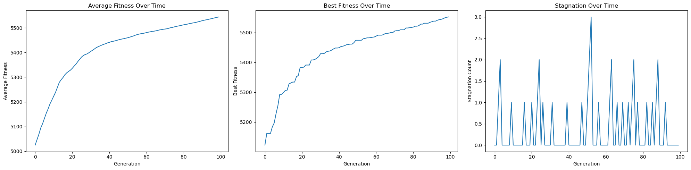
    


#### Single point crossover using radiation


```python
stagnation_limit = 6
mutation_increase = 0.9
mutation_rate = 0.8/n_genes
genetic_algorithm(n_generations, pop_size, n_genes, target, mutation_rate, elitism, stagnation_count, stagnation_limit,
fitness, population, best_fitness, use_radiation=True)
plot()
```

    Average fitness over time:  5469.574299999999
    Average best fitness over time:  5495.27
    Average stagnation over time:  0.32
    


    
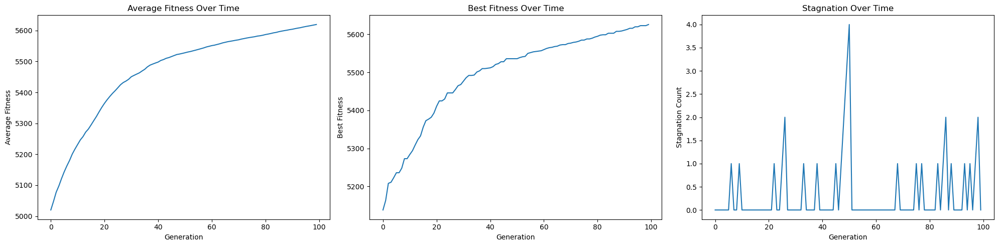
    


### Two point crossover

In two-pont crossover technique two random points on the parent chromosomes are selected, these points are the crossover points. The section of the chromosome between the two crossover points is swapped between the two parents to create two off springs. The first offspring is created by taking the genes before the first crossover point and after the second crossover point from the first parent, and the genes between the crossover points from the second parent. The second offspring is created conversely.

$$Parent A: 110|01001|01$$
$$Parent B: 101|11110|00$$

$$Offspring A: 110|11110|01$$
$$Offspring B: 101|01001|00$$

#### Two point crossover without radiation


```python
update_crossover('two_point_crossover')
```

    Crossover updated to 'two_point_crossover'
    


```python
genetic_algorithm(n_generations, pop_size, n_genes, target, mutation_rate, elitism, stagnation_count, stagnation_limit,
fitness, population, best_fitness, use_radiation=False)
plot()
```

    Average fitness over time:  5877.253099999999
    Average best fitness over time:  5940.16
    Average stagnation over time:  0.14
    


    
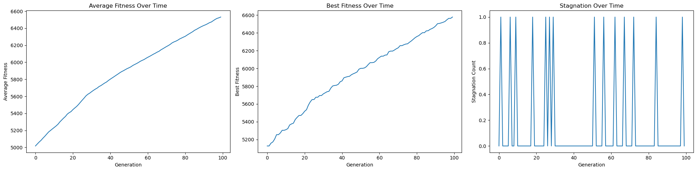
    


#### Two point crossover using radiation


```python
stagnation_limit = 6
mutation_increase = 0.9
mutation_rate = 0.8/n_genes
genetic_algorithm(n_generations, pop_size, n_genes, target, mutation_rate, elitism, stagnation_count, stagnation_limit,
fitness, population, best_fitness, use_radiation=True)
plot()
```

    Average fitness over time:  5909.671599999999
    Average best fitness over time:  5979.89
    Average stagnation over time:  0.19
    


    
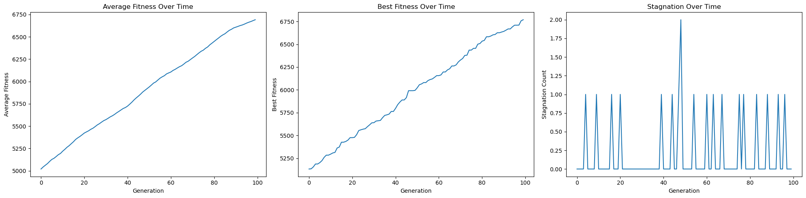
    


### Mid point crossover

In mid-point crossover technique we calculate the mid-point of two parents for each gene. For each gene position, the mid-point between the corresponding genes of the two parents is calculated by adding the values of the genes from both parents and dividing by them 2. It creates the offspring by selecting the mid-point values calculated.

$$Parent A: [1.0, 2.0, 3.0]$$
$$Parent B: [1.0, 2.0, 3.0]$$

$$
Mid-points: \left[ \frac{{1.0+4.0}}{2}, \frac{{2.0+5.0}}{2}, \frac{{3.0+6.0}}{2} \right] = [2.5, 3.5, 4.5]
$$

$$Offspring A: [2.5, 3.5, 4.5]$$

In the example above, the offspring is created by taking the mid-point of each pair of genes from the parents. This technique helps to maintain diversity in the population and prevents premature convergence to suboptimal solutions. However, like all crossover techniques, the effectiveness of mid-point crossover can depend on the type of problem.


```python
update_crossover('midpoint_crossover')
```

    Crossover updated to 'midpoint_crossover'
    

#### Mid point crossover without radiation


```python
genetic_algorithm(n_generations, pop_size, n_genes, target, mutation_rate, elitism, stagnation_count, stagnation_limit,
fitness, population, best_fitness, use_radiation=False)
plot()
```

    Average fitness over time:  89.2264
    Average best fitness over time:  5099.21
    Average stagnation over time:  21.71
    


    
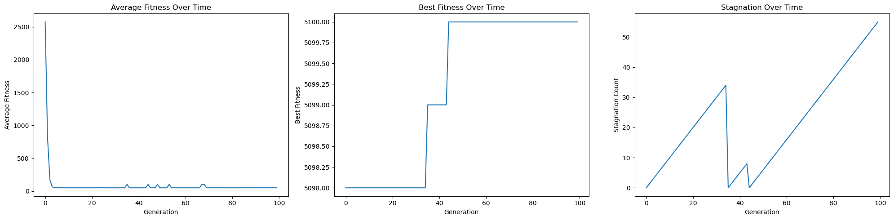
    


#### Mid point crossover using radiation


```python
stagnation_limit = 6
mutation_increase = 0.9
mutation_rate = 0.8/n_genes
genetic_algorithm(n_generations, pop_size, n_genes, target, mutation_rate, elitism, stagnation_count, stagnation_limit,
fitness, population, best_fitness, use_radiation=True)
plot()
```

    Average fitness over time:  88.74459999999999
    Average best fitness over time:  5098.14
    Average stagnation over time:  37.46
    


    
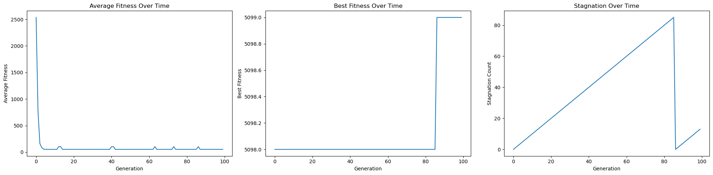
    


### Ring Crossover

Ring crossover is a novel operator designed to address the shortcomings of traditional crossover techniques. In traditional crossover methods, the ends of binary-encoded chromosomes tend to remain unaltered even when their fitness values are low. In ring crossover, the leftmost and rightmost parts of a chromosome are conjoined to form a ring. This allows offspring bits to be inherited from parent bits at both the front and rear positions. This technique helps increase population diversity while requiring a relatively low number of fitness evaluations.
steps in ring crossover:
* Ring formation
* Chromosome exchange
* Creation of offsprings

This method has been found to be effective in maintaining a variety of candidates in populations, preserving the building blocks of a solution, and requiring fewer fitness evaluations compared to traditional crossover methods. This technique is also very dependent on the specific problem and GA's configuration.

#### Ring crossover without radiation


```python
update_crossover('ring_crossover')
```

    Crossover updated to 'ring_crossover'
    


```python
genetic_algorithm(n_generations, pop_size, n_genes, target, mutation_rate, elitism, stagnation_count, stagnation_limit,
fitness, population, best_fitness, use_radiation=False)
plot()
```

    Average fitness over time:  5846.218199999999
    Average best fitness over time:  5905.63
    Average stagnation over time:  0.16
    


    
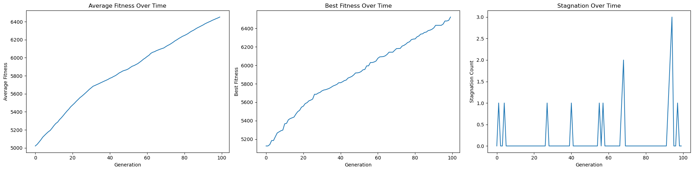
    


#### Ring crossover using radiation


```python
stagnation_limit = 6
mutation_increase = 0.9
genetic_algorithm(n_generations, pop_size, n_genes, target, mutation_rate, elitism, stagnation_count, stagnation_limit,
fitness, population, best_fitness, use_radiation=True)
plot()
```

    Average fitness over time:  5855.536899999999
    Average best fitness over time:  5916.74
    Average stagnation over time:  0.25
    


    
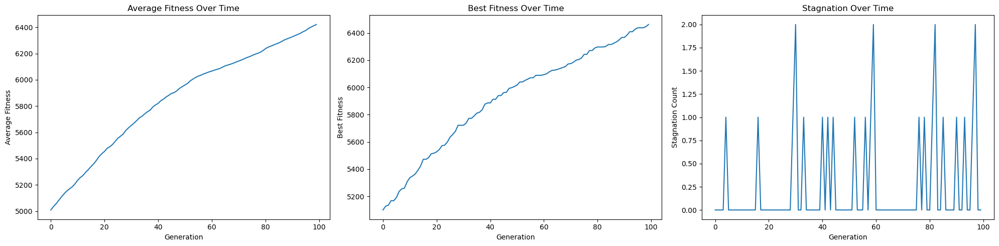
    


### Uniform Crossover

In unifiorm crossover technique a binary mask of the same length as the parent chromosomes is generated. This mask is generated randomly with each bit having a 50% chance of being 0 or 1. For each gene position ,if the mask at that position is 1, the gene from the first parent is copied to the offspring. If the mask at that position is 0, the gene from the second parent is copied to the offspring.

$$Parent  A:1100100101$$
$$Parent  B:1011111000$$
$$ Mask      :1010011001$$

$$Offspring:1001110001$$

Uniform crossover allows for greater exploration of the solution space compared to single-point and two-point crossover because of its inherent randomness which means that each gene has an equal probability of being selected from either parent, regardless of it's position in the chromosome. This randomness can lean to a greater variety of offspring, allowing the GA to explore more diverse regions of the solution space. Uniform crossover is also very flexible unlike single-point or two-point crossover which only allow exchange at certain points, uniform crossover can exchange gene at any position in the chromosome. This flexibilty can help break up blocks of genes and create new combinations, potentially leading to better solutions. This also helps maintain genetic diversity in the population and prevent premature convergence to suboptimal solutions. Uniform crossover is particulary useful when the problem has a complex landscape with many local optima as it can help the GA escape from local optima and find the global optimum. However, like all crossover techniques the performance of uniform crossover can be highly problem-dependent, and it may not always be the best choice for every problem.

#### Uniform crossover without radiation


```python
update_crossover('uniform_crossover')
```

    Crossover updated to 'uniform_crossover'
    


```python
genetic_algorithm(n_generations, pop_size, n_genes, target, mutation_rate, elitism, stagnation_count, stagnation_limit,
fitness, population, best_fitness, use_radiation=False)
plot()
```

    Average fitness over time:  5960.5328
    Average best fitness over time:  6031.49
    Average stagnation over time:  0.19
    


    
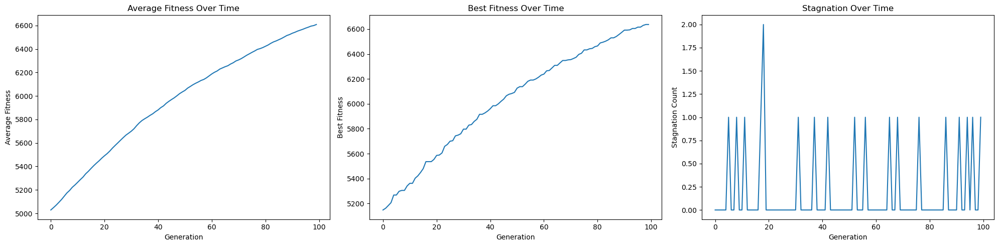
    


#### Uniform crossover using radiation


```python
stagnation_limit = 6
mutation_increase = 0.9
mutation_rate = 0.8/n_genes
genetic_algorithm(n_generations, pop_size, n_genes, target, mutation_rate, elitism, stagnation_count, stagnation_limit,
fitness, population, best_fitness, use_radiation=True)
plot()
```

    Average fitness over time:  5952.088700000001
    Average best fitness over time:  6022.15
    Average stagnation over time:  0.15
    


    
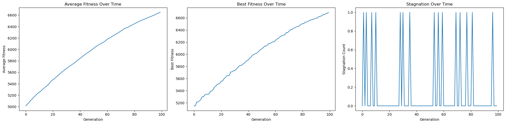
    


### Blend Crossover

This crossover technique is designed to create offsprings that are within a certain range of their parents, but not necessarily within the 'interval' of the parent's genes.

For each gene position,we calculate the interval as: 


$$Interval = \min(parentA, parentB) - \alpha \times range, \max(parentA, parentB) + \alpha \times range$$

where `range` is the absolute difference between the gene values of the two parents, and $\alpha$ is a parameter that controls the extent of the range. For each gene position, a random value is chosen within the calculated interval. This value is assigned to the corresponding gene in the offspring.

$$Parent A: [1.0, 2.0, 3.0]$$

$$Parent B: [4.0, 5.0, 6.0]$$

$$Intervals: [1.0 - 0.5*(4.0-1.0), 4.0 + 0.5*(4.0-1.0)],
            [2.0 - 0.5*(5.0-2.0), 5.0 + 0.5*(5.0-2.0)],
            [3.0 - 0.5*(6.0-3.0), 6.0 + 0.5*(6.0-3.0)]$$

$$Offspring: [randomval1,
            randomval2,
            randomval3]
$$

In the example, the offspring is created by selecting a random value within each interval.

#### Blend crossover without radiation


```python
update_crossover('blend_crossover')
```

    Crossover updated to 'blend_crossover'
    


```python
genetic_algorithm(n_generations, pop_size, n_genes, target, mutation_rate, elitism, stagnation_count, stagnation_limit,
fitness, population, best_fitness, use_radiation=False)
plot()
```

    Average fitness over time:  2999.1731710635477
    Average best fitness over time:  5098.0
    Average stagnation over time:  49.5
    


    
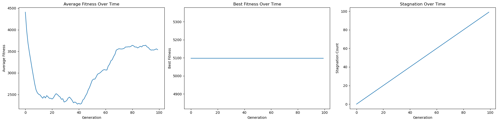
    


#### Blend crossover using radiation


```python
stagnation_limit = 6
mutation_increase = 0.9
mutation_rate = 0.8/n_genes
genetic_algorithm(n_generations, pop_size, n_genes, target, mutation_rate, elitism, stagnation_count, stagnation_limit,
fitness, population, best_fitness, use_radiation=True)
plot()
```

    Average fitness over time:  3436.5126015344804
    Average best fitness over time:  5098.933652420277
    Average stagnation over time:  25.27
    


    
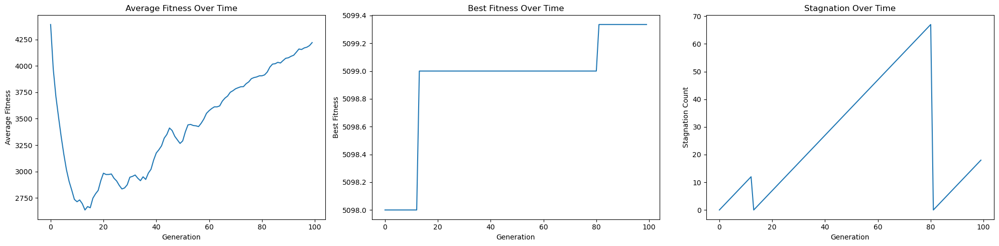
    


### Multi-parent recombination

In this technique more than two parents are involved in creation of the offspring. The core Idea is that more than two parents in the crossover process could result in more better progeny. This crossover is carried out in two crucial steps

* Gene scanning - for each gene positions in the offspring, one parent is chosen at random. The gene at the current position of the chosen parent is copied to the offspring.
* Diagonal crossover - multiple parents are selected and a sequence of crossover points is chosen, the offspring is created by taking genes from the parents in a round-robin fashion, switching to the next parent at each crossover point. This results in an offspring that inherits a 'diagonal' slice if genes from each parent.

These methods increase the diversity of the population and help explore the seach space more effectively.However, the effevtiveness of these methods again depend on the specific problem.

#### Gene scanning and diagonal crossover without radiation


```python
update_crossover('gene_scanning_and_diagonal_crossover')
```

    Crossover updated to 'gene_scanning_and_diagonal_crossover'
    


```python
genetic_algorithm(n_generations, pop_size, n_genes, target, mutation_rate, elitism, stagnation_count, stagnation_limit,
fitness, population, best_fitness, use_radiation=False)
plot()
```

    Average fitness over time:  5897.357600000001
    Average best fitness over time:  5961.01
    Average stagnation over time:  0.25
    


    
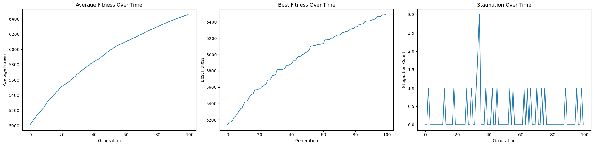
    


#### Gene scanning and diagonal crossover using radiation


```python
stagnation_limit = 6
mutation_increase = 0.9
mutation_rate = 0.8/n_genes
genetic_algorithm(n_generations, pop_size, n_genes, target, mutation_rate, elitism, stagnation_count, stagnation_limit,
fitness, population, best_fitness, use_radiation=True)
plot()
```

    Average fitness over time:  5869.682300000001
    Average best fitness over time:  5931.88
    Average stagnation over time:  0.22
    


    
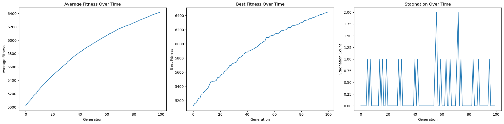
    


## Results

* Average fitness over time (`AF`)  is the measure of average fitness score of all individuals in the population, if it increses it means the population is improving and GA is converging towards a solution.
* Average best fitness over time (`ABF`) is the measure of how the best solution is improving over time.If Average best fitness is increasing, it  means the GA us consistently finding better solutions.
* Average Stagnation (`STG`) over time is the measure of how often the GA stagnates or gets stuck in a local optimum.

| Crossover Technique | AF without radiation |AF with radiation |
| --- | --- | --- |
| Single point crossover | 5388.27 | 5450.41 |
| Two point crossover | 5889.24 | 6029.48 |
| Mid point crossover | 88.23 | 87.11 |
| Ring crossover | 5969.19 | 5912.18 |
| Uniform crossover | 5922.86 | 5941.21 |
| Blend crossover| 2448.38 | 3282.40 |
| Multi Parent crossover | 5908.63 | 5900.80 |


| Crossover Technique | ABF without radiation |ABF with radiation |
| --- | --- | --- |
| Single point crossover | 5407.92 | 5474.22 |
| Two point crossover | 5963.08 | 6105.13 |
| Mid point crossover | 5133.22 | 5132.0 |
| Ring crossover | 6029.84 | 5974.52 |
| Uniform crossover | 5989.16 | 6006.675 |
| Blend crossover| 5132.0 | 5132.0 |
| Multi Parent crossover | 5969.06 | 5964.3 |


| Crossover Technique | STG without radiation |STG with radiation |
| --- | --- | --- |
| Single point crossover | 0.28 | 0.22 |
| Two point crossover | 0.15 | 0.14 |
| Mid point crossover | 25.71 |  49.5 |
| Ring crossover | 0.18 | 0.14 |
| Uniform crossover | 0.19 | 0.14 |
| Blend crossover| 49.5 | 49.5 |
| Multi Parent crossover |  0.19 | 0.14 |


* Average fitness increased in case of `single point crossover`, `two point crossover`, `uniform crossover`,`blend crossover` increased and in the rest it decreased. `Blend crosoveer` has mixed results as its fitness is lower when compared to other GA's.

* Similarly Average best fitness in `single point crossover`, `two point crossover`, `uniform crossover` also increased and in others it decreased. In case of `blend crossover` it stays the same without and with radiation .

* When calulating Stagnation count we find that `single point crossover`,`ring crossover`, `two point crossover`, `uniform crossover` and `Mulit parent crossover`have reduced stagnation when using radiation function. while in others it increased.

## Conclusion

The application of various crossover techniques in Genetic Algorithms coupled with a radiation function has shown promising results. The average fitness and average best fitness have generally increased. Interestingly, `blend crossover` demonstrated a significant increase in fitness with the application of the radiation function, despite having lower fitness compared to other GAs. This warrants further investigation to rule out possible errors and to understand the underlying cause of this drastic improvement.

The stagnation count, an indicator of the algorithm's progress, decreased for `single point crossover`, `ring crossover`, `two point crossover`, `uniform crossover`, and `Multi-parent crossover` when the radiation function was applied. This suggests that the radiation function may be effective in preventing premature convergence and maintaining diversity in the population. However, it's important to note that the results varied across different crossover techniques, and in some cases, the performance actually decreased. This highlights the need for careful selection and tuning of GA parameters based on the specific problem and algorithm characteristics.

Overall, these results are quite promising, suggesting that the radiation function could be a viable addition to GAs. However, further and more extensive experiments are needed to confirm these findings and to optimize the use of the radiation function in GAs. Future work could also explore the application of this approach to different types of problems and datasets to assess its generalizability and effectiveness in a broader context.

## References

__Bibliography:__
    
* Genetic algorithms with multi-parent recombination: https://link.springer.com/chapter/10.1007/3-540-58484-6_252
* “Choosing Mutation and Crossover Ratios for Genetic Algorithms—A Review with a New Dynamic Approach” by Ahmad Hassanat https://www.mdpi.com/2078-2489/10/12/390
* “The optimal crossover or mutation rates in Genetic algorithm” investigating the optimal cross-over probabilities and mutation probabilities for the optimum performance of GA. https://www.cibtech.org/J-ENGINEERING-TECHNOLOGY/PUBLICATIONS/2015/VOL-5-NO-3/05-JET-006-PATIL-MUTATION.pdf
* “Fast Genetic Algorithms” https://arxiv.org/abs/1703.03334
    
